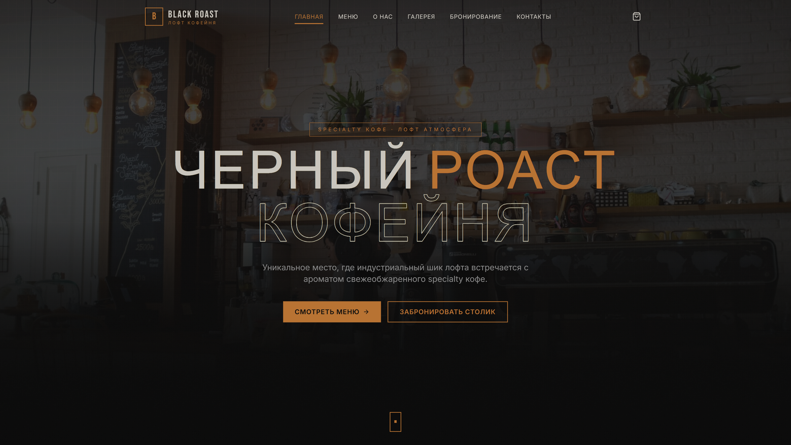
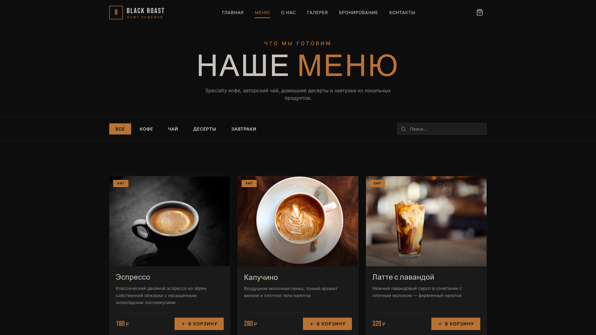
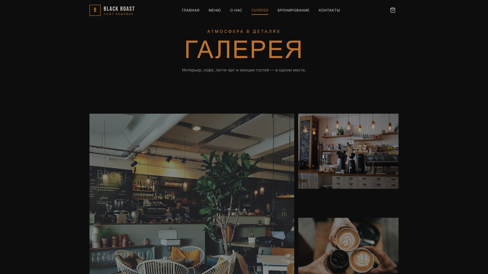
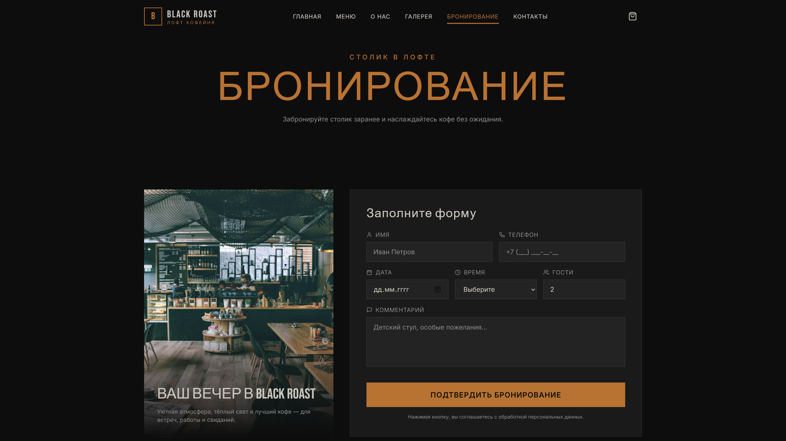
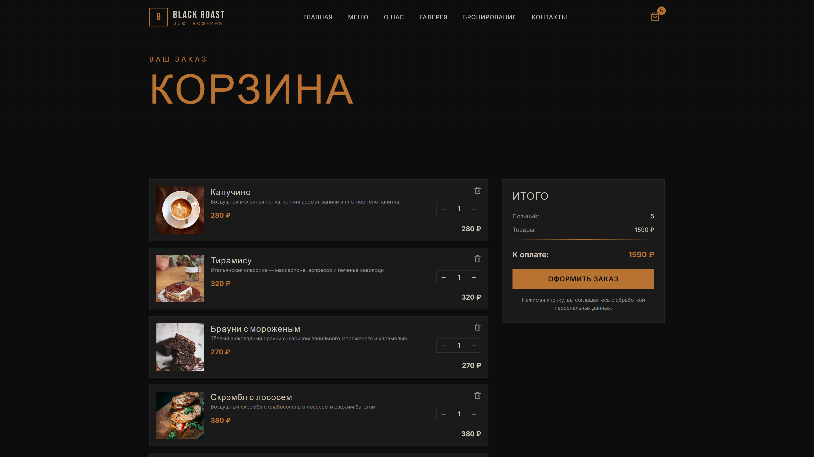
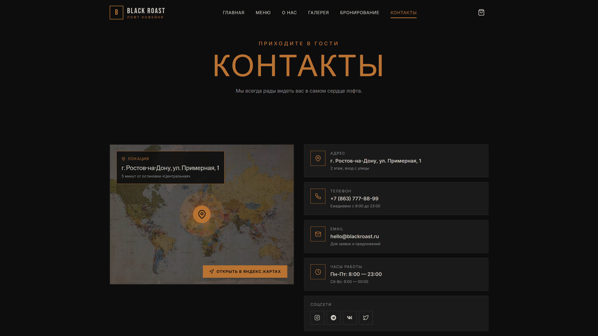

# BLACK ROAST — Лофт кофейня

Многостраничный сайт кофейни в стиле «лофт» на React + Vite + Tailwind CSS + React Router.

## Скриншоты

| Главная | Меню | Галерея |
|---|---|---|
|  |  |  |

| Бронирование | Корзина | Контакты |
|---|---|---|
|  |  |  |

## Возможности

### 🏠 Главная
- Hero-секция с фоновым изображением и плавным градиентом
- Бегущая строка с акциями
- Блок преимуществ (своя обжарка, свежая выпечка, уютный лофт, быстрая доставка)
- Популярные позиции (4 карточки)
- Отзывы (слайдер Swiper)
- CTA-блок «Забронировать столик»

### ☕ Меню
- Фильтр по категориям: Кофе, Чай, Десерты, Завтраки
- Поиск по названию
- Карточки с фото, описанием, ценой
- Кнопка «В корзину» (выровнена по низу карточки)
- Счётчик товаров в шапке

### 📖 О нас
- История кофейни
- Команда (фото + имена)
- Ценности
- Фото интерьера

### 🖼 Галерея
- Сетка фото с hover-зумом
- Lightbox при клике

### 📅 Бронирование
- Форма: имя, телефон, дата, время, количество гостей, комментарий
- Валидация полей
- Поля выровнены в аккуратную сетку
- Подтверждение бронирования

### 🛒 Корзина
- Хранится в LocalStorage (не теряется при перезагрузке)
- Добавление / удаление / изменение количества
- Подсчёт суммы и количества
- Оформление: самовывоз или доставка
- Заглушка отправки заказа с подтверждением

### 📞 Контакты
- Карта (заглушка с адресом)
- Адрес, телефон, часы работы
- Форма обратной связи
- Соцсети

## Стек

| Технология | Версия | Назначение |
|---|---|---|
| React | 18 | UI |
| Vite | 5 | Сборка |
| Tailwind CSS | 3 | Стили |
| React Router | 6 | Навигация |
| Framer Motion | 11 | Анимации |
| Lenis | — | Плавный скролл |
| Swiper | 11 | Слайдеры |
| React Icons | 5 | Иконки |

## Дизайн (лофт)

- **Палитра**: чёрный, серый, кирпичный, металлик
- **Акценты**: медный `#b87333`, тёплый оранжевый `#e89a4a`
- **Типографика**: Bebas Neue (заголовки) + Inter (текст)
- **Фактуры**: SVG-паттерны кирпича и бетона в CSS
- **Анимации**: Framer Motion (fade-up, layout, hover)
- **Плавный скролл**: Lenis

## Быстрый запуск

Установите зависимости:
```bash
npm install
```

Запустите dev-сервер:
```bash
npm run dev
```
Сайт откроется на `http://localhost:5173`

Сборка для продакшена:
```bash
npm run build
```
Готовая сборка появится в папке `dist/`. Для предпросмотра:
```bash
npm run preview
```

## Структура проекта

```
/
├── package.json
├── vite.config.js
├── tailwind.config.js
├── postcss.config.js
├── index.html
└── src/
    ├── main.jsx              # Точка входа + провайдеры
    ├── App.jsx               # Роутинг + Lenis smooth scroll
    ├── index.css             # Глобальные стили + Tailwind layers
    ├── data/
    │   └── menu.js           # Данные меню, команды, галереи, отзывов
    ├── context/
    │   └── CartContext.jsx   # Контекст корзины + LocalStorage
    ├── components/
    │   ├── Header.jsx        # Шапка + мобильное меню + счётчик корзины
    │   ├── Footer.jsx        # Подвал с кирпичной фактурой
    │   ├── ProductCard.jsx   # Карточка товара
    │   ├── ServiceCard.jsx   # Карточка преимущества
    │   └── PageTransition.jsx# Анимация переходов между страницами
    └── pages/
        ├── Home.jsx          # Hero, бегущая строка, преимущества, популярные, отзывы, CTA
        ├── Menu.jsx          # Меню с фильтром по категориям + поиск
        ├── About.jsx         # История, вехи, команда, ценности
        ├── Gallery.jsx       # Сетка фото + Lightbox
        ├── Booking.jsx       # Форма бронирования + валидация
        ├── Contacts.jsx      # Карта, контакты, форма обратной связи
        └── Cart.jsx          # Корзина + checkout (самовывоз/доставка)
```

## Страницы

| Маршрут | Описание |
|---|---|
| `/` | Главная (Hero, акции, преимущества, популярное, отзывы, CTA) |
| `/menu` | Меню с фильтром по категориям |
| `/about` | История, команда, ценности |
| `/gallery` | Галерея с lightbox |
| `/booking` | Бронирование столика |
| `/cart` | Корзина + оформление заказа |
| `/contacts` | Контакты, карта, форма обратной связи |

## Деплой

1. Залей репозиторий на GitHub.
2. Зайди на [vercel.com](https://vercel.com), подключи GitHub.
3. Выбери репозиторий `coffee-loft`.
4. Vercel сам соберёт и задеплоит.
5. Ссылка будет вида `https://coffee-loft.vercel.app`.

## Лицензия

MIT